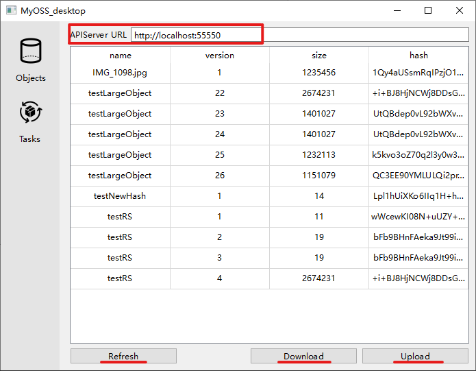

# develop environment
QT6.2.4
# how to use

### 1. fill in apiserver url on the top of 'Objects' page.（apiserver can be employed according to [myOSS-server](https://github.com/ih8gin/myOSS-server)）
### 2. click refresh button below to pull stored objects information list from apiserver.
### 3. click download button or upload button，then choose download dir or upload file to submit transfer task.