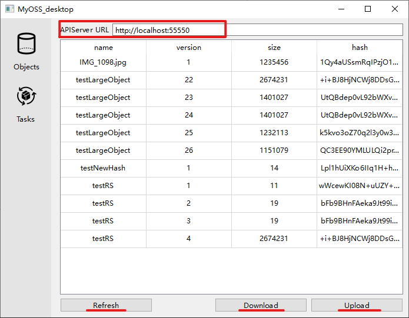

# 开发环境
QT6.2.4
# 使用方法

### 1. 在对象页面上部填入apiserver url（参考[myOSS-server](https://github.com/ih8gin/myOSS-server)可以部署apiserver）
### 2. 点击下方refresh刷新按钮，从apiserver拉取已经存入的对象名称、版本等信息
### 3. 点击download下载或upload上传按钮，在弹出窗口中选择下载路径或上传文件后点击确认后提交传输任务